# Design and control of a simulated anthropomorphic robotic finger using differentiable programming

## Author

This thesis was made by Killian Storm and was submitted in order to obtain the academic degree of Master of Science in Computer Science Engineering.

## Introduction

This is the repository for my master's dissertation. It contains the book and the accompanying source code and animations.

## Usage

Simply run 'pip install -r requirements.txt' in a terminal with support for Python 3.7 or above to install all packages.

There is an option to enable loaded trajectories by changing the boolean **ENABLE_PIANO_KEY** in 'finger_model/simulation/dynamic_model.py'. Make sure this is set to **True** when running the piano key simulation, and set to **False** when running any other unloaded simulation.

### Reproduce results

You can choose to either locally execute the files or execute the Jupyter notebooks which are linked to Google CoLab. This requires no installation and can be run from within a browser.

#### Locally

The results discussed in Chapter 6 can be reproduced by running 'finger_model/analysis/comparison/comparison.py'.

The results discussed in Chapter 7 can be reproduced by the running desired experiment in 'finger_model/analysis/learning/tendon_model/'.

#### Google CoLab
The results of the comparison between the physical setup and the simulator (Chapter 6) can be reproduced by running:
 - [Comparison](https://colab.research.google.com/github/killianstorm/simulated-anthropomorphic-finger/blob/master/finger_model/notebooks/comparison_physical_setup/comparison_physical_setup.ipynb)

The results of the optimisation algorithm (Chapter 7) can be reproduced by running the desired experiments:

##### Unloaded
 - [Full grasp](https://colab.research.google.com/github/killianstorm/simulated-anthropomorphic-finger/blob/master/finger_model/notebooks/unloaded/learning_grasp.ipynb)
 - [Sine](https://colab.research.google.com/github/killianstorm/simulated-anthropomorphic-finger/blob/master/finger_model/notebooks/unloaded/learning_sine.ipynb)
 - [Perfect circle](https://colab.research.google.com/github/killianstorm/simulated-anthropomorphic-finger/blob/master/finger_model/notebooks/unloaded/learning_circle.ipynb)
 - [Sudden force change](https://colab.research.google.com/github/killianstorm/simulated-anthropomorphic-finger/blob/master/finger_model/notebooks/unloaded/learning_suddenforcechange.ipynb)

##### Loaded
> **Note:** CoLab returns an unexpected error where Abs is not found, this error does not occur when the Python file is run locally.

> **Note:** This notebook is set on another branch (pianokey) where ENABLE_PIANO_KEY is set to True.

 - [Pianokey](https://colab.research.google.com/github/killianstorm/simulated-anthropomorphic-finger/blob/pianokey/finger_model/notebooks/loaded/learning_pianokey.ipynb)

## Animations

### Comparison between physical setup and simulator

Full grasp:

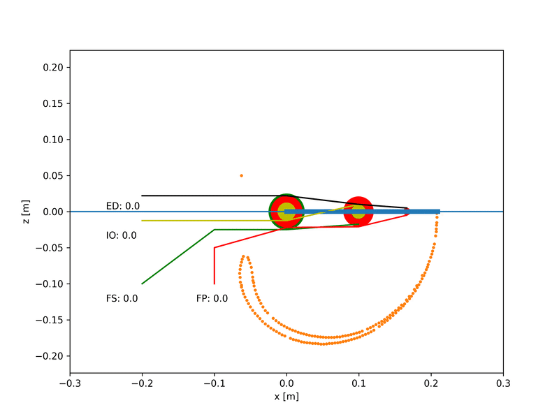

Extended PIP:

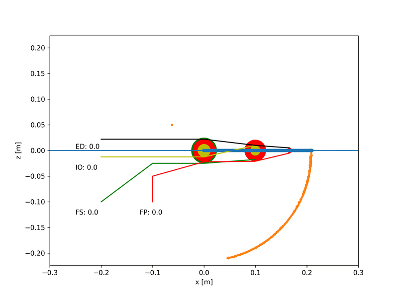

Extended MCP:

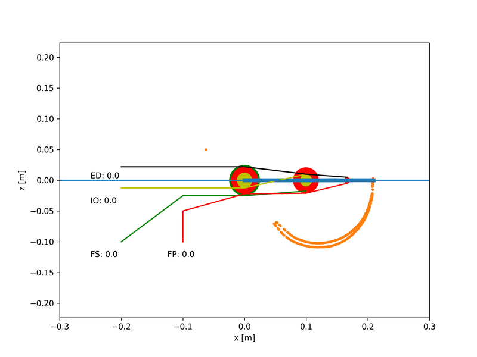

Complex:

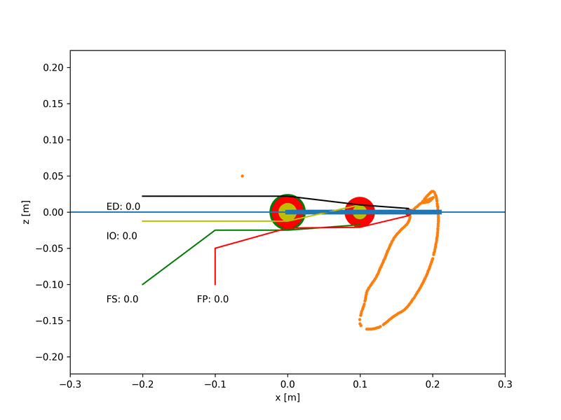

### Learning trajectories

#### Unloaded

Full grasp with angles/angle velocities loss function:

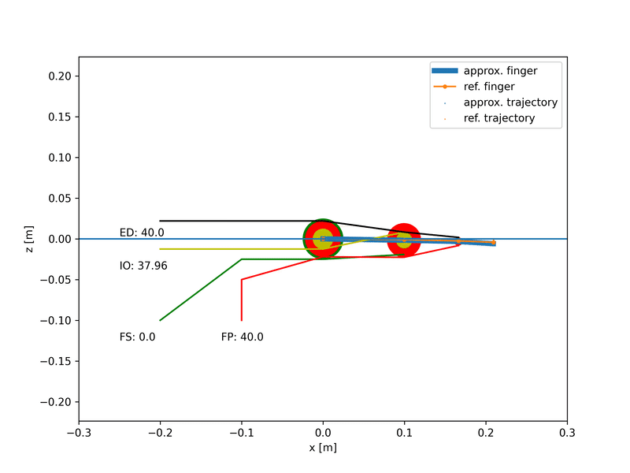

Full grasp with end-effector loss function:

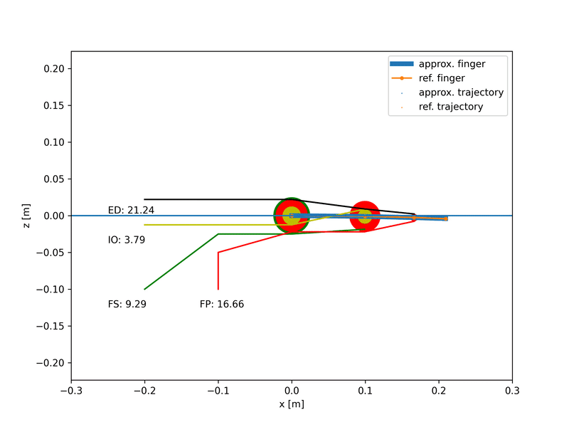

Sine with angles/angle velocities loss function:

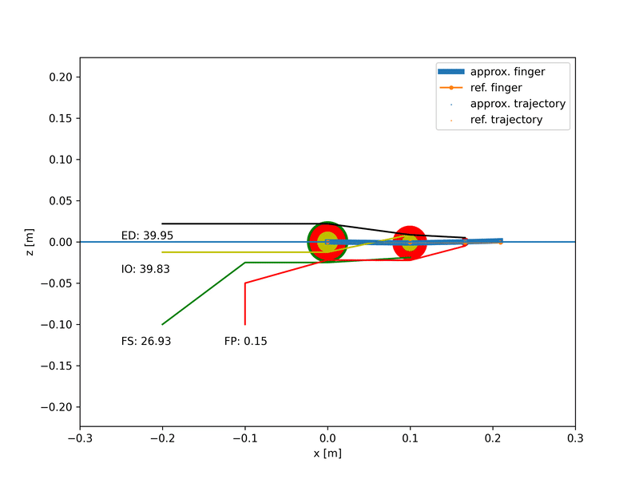

Sine with end-effector loss function:

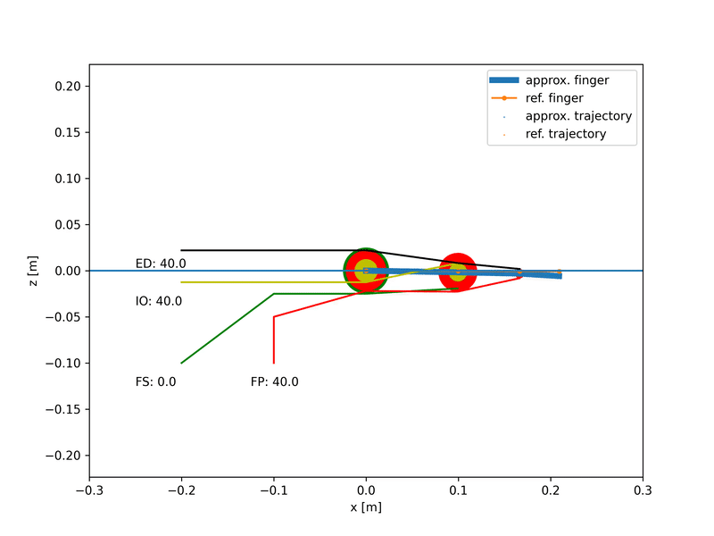

Perfect circle with end-effector loss function:

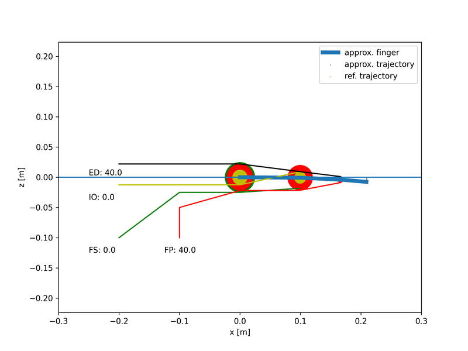

Sudden force change with angles/angle velocities loss function:

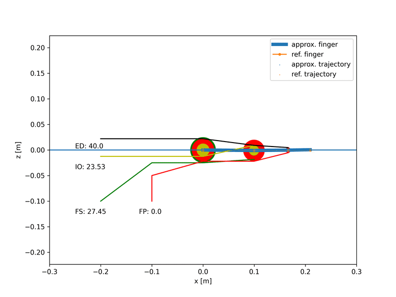

Sudden force change with end-effector loss function:

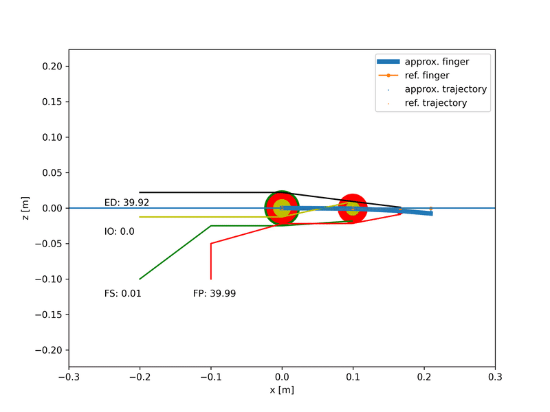

#### Loaded

Piano key stroke with angles/angle velocities loss function:

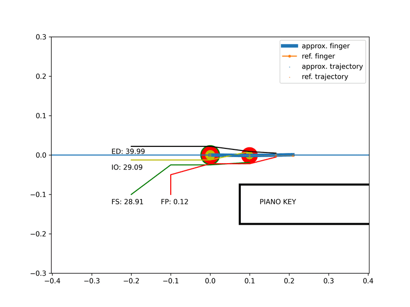

